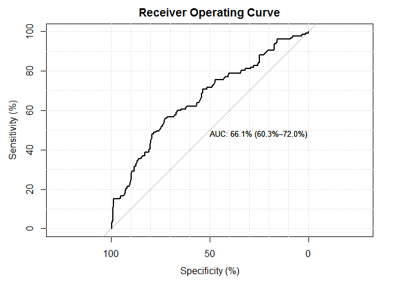
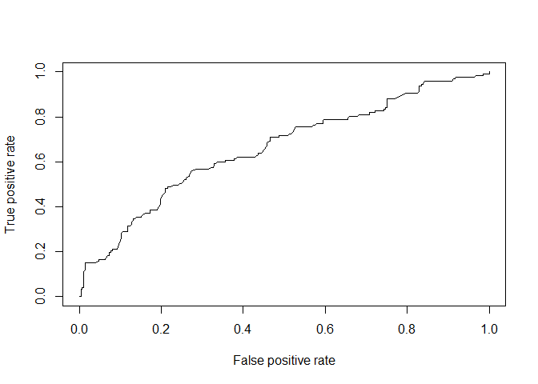
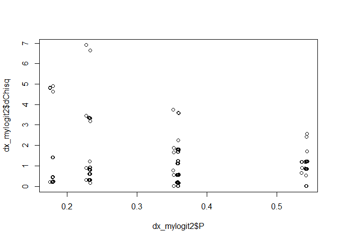
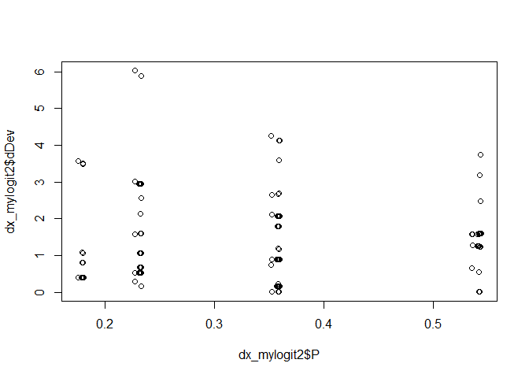

# Binary Logistic Regression DrPH (Epidemiology)
Kamarul Imran M  
1 February 2016  

\newpage

# Introduction

## Modeling Binary Outcome Data 

The suggested steps are:

1. Describe data
2. Explore data - Exploratory Data Analysis
3. Estimate parameters 
4. Interpret parameters
4. Make Inference
5. Calculate the fitted values 
6. Make Prediction
7. Assessing model
8. Remedy model


# Prepare workspace

## Locate files

* Browse your folders. 
* Look for the files. 
* Check the path to the folder containing the files

## Set the folder  

Set our working directory. REMEMBER! your working directory (working folder) is different from my working directory


```r
# this is my working directory. You have to specify yours
setwd("E:/Epi_Stat_Matters/LectureNotes2015/binary-logistic/binary-logistic-DrPH-2015/BinaryLogisticDrPH-Epid/Binary_Logistic_DrPH_Epid_Practicals")
```

## Read data

* Read our data in the working folder
* Then, save as a csv file in our working directory


```r
mydata <- read.csv('logistic_data.csv', sep = ",", header = TRUE)
```

# Preliminary analysis

## Describe your data


```r
# observe data the first 10 observations 
head(mydata,10)
```

More fancy, we can use *psych::describe* function


```r
library(psych)
describe(mydata)
```

```
##       vars   n   mean     sd median trimmed    mad min max range  skew
## id       1 400 200.50 115.61  200.5  200.50 148.26   1 400   399  0.00
## admit    2 400   0.32   0.47    0.0    0.27   0.00   0   1     1  0.78
## gre      3 400 587.70 115.52  580.0  589.06 118.61 220 800   580 -0.14
## gpa      4 400 281.59 122.26  327.5  302.23  49.67   3 399   396 -1.51
## rank     5 400   2.48   0.94    2.0    2.48   1.48   1   4     3  0.10
##       kurtosis   se
## id       -1.21 5.78
## admit    -1.39 0.02
## gre      -0.36 5.78
## gpa       0.72 6.11
## rank     -0.91 0.05
```

Admit and Rank are taken as numerical variable which does not make sense. 
We need to convert them to categorical (factor) variables.


```r
str(mydata$admit)
```

```
##  int [1:400] 0 1 1 1 0 1 1 0 1 0 ...
```

```r
str(mydata$rank)
```

```
##  int [1:400] 3 3 1 4 4 2 1 2 3 2 ...
```


```r
mydata$admit2 <- factor(mydata$admit, labels = c('no','yes'))
mydata$rank2 <- factor(mydata$rank, labels = c('first', 'second', 'third', 'fourth'))
head(mydata)
```

```
##   id admit gre gpa rank admit2  rank2
## 1  1     0 380 361    3     no  third
## 2  2     1 660 367    3    yes  third
## 3  3     1 800   4    1    yes  first
## 4  4     1 640 319    4    yes fourth
## 5  5     0 520 293    4     no fourth
## 6  6     1 760   3    2    yes second
```

```r
str(mydata)
```

```
## 'data.frame':	400 obs. of  7 variables:
##  $ id    : int  1 2 3 4 5 6 7 8 9 10 ...
##  $ admit : int  0 1 1 1 0 1 1 0 1 0 ...
##  $ gre   : int  380 660 800 640 520 760 560 400 540 700 ...
##  $ gpa   : int  361 367 4 319 293 3 298 308 339 392 ...
##  $ rank  : int  3 3 1 4 4 2 1 2 3 2 ...
##  $ admit2: Factor w/ 2 levels "no","yes": 1 2 2 2 1 2 2 1 2 1 ...
##  $ rank2 : Factor w/ 4 levels "first","second",..: 3 3 1 4 4 2 1 2 3 2 ...
```

## Explore your data

Use plots like
* Histogram for numerical variables
* and barplot for categorical variables, at least. 


# Model parameters

## Estimate parameters

* we estimate the logit or the log odds using `glm` function. 
* We used **summary** to see the results stored as the glm model for example **mylogit** 
* We used **coefficients** to examine the regression coefficients
 


```r
mylogit <- glm(admit2 ~ gre + gpa + rank2,family = 'binomial'(link = logit),data=mydata)
summary(mylogit)
```

```
## 
## Call:
## glm(formula = admit2 ~ gre + gpa + rank2, family = binomial(link = logit), 
##     data = mydata)
## 
## Deviance Residuals: 
##     Min       1Q   Median       3Q      Max  
## -1.5433  -0.8767  -0.6628   1.1765   2.1111  
## 
## Coefficients:
##               Estimate Std. Error z value Pr(>|z|)    
## (Intercept) -1.9111500  0.7353719  -2.599 0.009353 ** 
## gre          0.0032583  0.0010248   3.179 0.001476 ** 
## gpa          0.0003353  0.0009074   0.370 0.711742    
## rank2second -0.7275007  0.3135321  -2.320 0.020323 *  
## rank2third  -1.2975794  0.3413183  -3.802 0.000144 ***
## rank2fourth -1.6149925  0.4165532  -3.877 0.000106 ***
## ---
## Signif. codes:  0 '***' 0.001 '**' 0.01 '*' 0.05 '.' 0.1 ' ' 1
## 
## (Dispersion parameter for binomial family taken to be 1)
## 
##     Null deviance: 499.98  on 399  degrees of freedom
## Residual deviance: 464.39  on 394  degrees of freedom
## AIC: 476.39
## 
## Number of Fisher Scoring iterations: 4
```

If we would like to see the estimated *beta* then we can use this


```r
coefficients(mylogit)
```

```
##   (Intercept)           gre           gpa   rank2second    rank2third 
## -1.9111499778  0.0032583228  0.0003352836 -0.7275006519 -1.2975794243 
##   rank2fourth 
## -1.6149924866
```

To obtain the odds ratios and their 95% CI, we need to exponentiate using *exp* the regression coefficients or the *betas* 


```r
exp(coefficients(mylogit))
```

```
## (Intercept)         gre         gpa rank2second  rank2third rank2fourth 
##   0.1479102   1.0032636   1.0003353   0.4831150   0.2731923   0.1988922
```

```r
exp(confint(mylogit))
```

```
## Waiting for profiling to be done...
```

```
##                  2.5 %    97.5 %
## (Intercept) 0.03415901 0.6144596
## gre         1.00127977 1.0053190
## gpa         0.99858052 1.0021497
## rank2second 0.25984518 0.8912208
## rank2third  0.13855091 0.5299810
## rank2fourth 0.08529634 0.4403356
```

## Interpret parameters 

1.  Interpret the *betas* (the log odds) and their 95% CIs
2.  Interpret the *odds ratios* and their 95% CIs

## Inference

Here, we examine 

1.  the p-values (hypothesis testing) and 
2.  the confidence intervals. 

What is the p-values?

The p-value is defined as the probability of obtaining a result equal to or "more extreme" than what was actually observed, when the null hypothesis is true. In frequentist inference, the p-value is widely used in statistical hypothesis testing, specifically in null hypothesis significance testing.
Ref: <https://en.wikipedia.org/wiki/P-value>

For example, suppose that a vaccine study produced a P value of 0.04. This P value indicates that if the vaccine had no effect, you’d obtain the observed difference or more in 4% of studies due to random sampling error.
Reg: <http://blog.minitab.com/blog/adventures-in-statistics-2/how-to-correctly-interpret-p-values>

* First, using the method of maximum likelihood 
* Next, using the SE method (function **confint.default**)


```r
confint(mylogit)
```

```
## Waiting for profiling to be done...
```

```
##                    2.5 %       97.5 %
## (Intercept) -3.376728935 -0.487012169
## gre          0.001278956  0.005304904
## gpa         -0.001420487  0.002147363
## rank2second -1.347669301 -0.115163021
## rank2third  -1.976517404 -0.634914172
## rank2fourth -2.461623762 -0.820218220
```

```r
confint.default(mylogit)
```

```
##                    2.5 %       97.5 %
## (Intercept) -3.352452441 -0.469847515
## gre          0.001249682  0.005266964
## gpa         -0.001443097  0.002113664
## rank2second -1.342012230 -0.112989074
## rank2third  -1.966550970 -0.628607878
## rank2fourth -2.431421835 -0.798563138
```

# Fitted and predicted values

## Fitted values

The fitted values are the expected values of the model. These expected values are the predicted probability for each observation (each patient) in the dataset. You can use 2 functions of getting the fitted values


```r
fitted(mylogit)
predict(mylogit, type = 'response')
```

Manually, we can do this to calculate (verify) the conditional probability of being admitted for the current dataset


```r
head(fitted(mylogit))
```

```
##         1         2         3         4         5         6 
## 0.1359282 0.2818735 0.6674889 0.2085215 0.1501307 0.4597574
```

```r
# calculate the logistic probability for the 1st observation
exp(-1.567)/(1+exp(-1.567))
```

```
## [1] 0.1726445
```


# Predicted values

In R, you can prediction of the outcome based on a set of a new data

## Create a new data to make prediction

Similarly, one of the important objectives in modelling is to perform prediction based on the model using new data. 

We can perform these predictions: 

1. Predict the log odds for having the outcome
2. Predict the conditional probability for having the outcome 

Let us say we have these data

gre = 380
gpa = 3.61
rank = first,second, third, fourth

First, we create a data frame


```r
new_datal <- data.frame( gre = 380, gpa = 3.61, rank2 = c('first','second','third', 'fourth'))
new_datal
```

```
##   gre  gpa  rank2
## 1 380 3.61  first
## 2 380 3.61 second
## 3 380 3.61  third
## 4 380 3.61 fourth
```

Now, we predict the log odds for being **admitted** for a population with **gre=30**, **gpa=3.61** and for different **rank**


```r
pred.logit<-predict(mylogit,newdata = new_datal, type='link')
pred.logit
```

```
##          1          2          3          4 
## -0.6717769 -1.3992776 -1.9693564 -2.2867694
```

We can confirm this by calculate this (using first and third rank)


```r
-3.99 + 0.00226*380 + 0.8041*3.61 + 0
```

```
## [1] -0.228399
```

```r
-3.99 + 0.00226*380 + 0.8041*3.61 - 1.34
```

```
## [1] -1.568399
```

Notice, that similarity between **predict(x, type='response')** and **fitted** 
Remember, we can calculate the conditional probability of having the outcome 


# Compare models

We compare a model with **gre** and without **gre**. This is done using the deviance method


```r
mylogit2 <- glm(admit2 ~ gpa + rank2, family = 'binomial'(link = logit),data=mydata)
anova(mylogit, mylogit2, test = 'Chisq')
```

```
## Analysis of Deviance Table
## 
## Model 1: admit2 ~ gre + gpa + rank2
## Model 2: admit2 ~ gpa + rank2
##   Resid. Df Resid. Dev Df Deviance Pr(>Chi)   
## 1       394     464.39                        
## 2       395     474.96 -1  -10.562 0.001154 **
## ---
## Signif. codes:  0 '***' 0.001 '**' 0.01 '*' 0.05 '.' 0.1 ' ' 1
```

The p-value shows that mylogit and mylogit2 are different. It suggests the importance of **gre** at the level of significance of 5%. So should we keep **gre**? Perhaps yes, if we take the p-value as the requirement to assess for variable significance.  

# Model assessment

## Linearity in logits 

**gre** is tested for linearity in logit. **gre** is linear but it is rescaled to produce less decimals 

The linearity of logits is tested using library *mfp* package


```r
library(mfp)
```

```
## Loading required package: survival
```

```r
mylogit3 <- mfp(admit2 ~ fp(gre)+ gpa + rank2, family = 'binomial'(link = logit),data=mydata,verbose=T)
```

```
## 
## 	Variable	Deviance	Power(s)
## ------------------------------------------------
## Cycle 1
## 	rank2second	 	 	 
## 	        	469.817	 	 
## 	        	464.394	 	1
## 	        			 		
## 	        			 		
## 
## 	rank2third	 	 	 
## 	        	479.238	 	 
## 	        	464.394	 	1
## 	        			 		
## 	        			 		
## 
## 	rank2fourth	 	 	 
## 	        	480.888	 	 
## 	        	464.394	 	1
## 	        			 		
## 	        			 		
## 
## 	gre	 	 	 	 
## 	        	474.957	 	 
## 	        	464.394	 	1
## 	        	464.208	 	0
## 	        	464.154	 	-2 -1
## 
## 	gpa	 	 	 	 
## 	        	464.532	 	 
## 	        	464.394	 	1
## 	        			 		
## 	        			 		
## 
## 
## Tansformation
##             shift scale
## rank2second     0     1
## rank2third      0     1
## rank2fourth     0     1
## gre             0  1000
## gpa             0     1
## 
## Fractional polynomials
##             df.initial select alpha df.final power1 power2
## rank2second          1      1  0.05        1      1      .
## rank2third           1      1  0.05        1      1      .
## rank2fourth          1      1  0.05        1      1      .
## gre                  4      1  0.05        1      1      .
## gpa                  1      1  0.05        1      1      .
## 
## 
## Transformations of covariates:
##               formula
## gre   I((gre/1000)^1)
## gpa               gpa
## rank2           rank2
## 
## 
## Deviance table:
##  		 Resid. Dev
## Null model	 499.9765
## Linear model	 464.3945
## Final model	 464.3945
```

Now, let us check the estimated parameters based on fractional polynomials


```r
summary(mylogit3)
```

```
## 
## Call:
## glm(formula = admit2 ~ rank2 + I((gre/1000)^1) + gpa, family = binomial(link = logit), 
##     data = mydata)
## 
## Deviance Residuals: 
##     Min       1Q   Median       3Q      Max  
## -1.5433  -0.8767  -0.6628   1.1765   2.1111  
## 
## Coefficients:
##                   Estimate Std. Error z value Pr(>|z|)    
## (Intercept)     -1.9111500  0.7353719  -2.599 0.009353 ** 
## rank2second     -0.7275007  0.3135321  -2.320 0.020323 *  
## rank2third      -1.2975794  0.3413183  -3.802 0.000144 ***
## rank2fourth     -1.6149925  0.4165532  -3.877 0.000106 ***
## I((gre/1000)^1)  3.2583228  1.0248358   3.179 0.001476 ** 
## gpa              0.0003353  0.0009074   0.370 0.711742    
## ---
## Signif. codes:  0 '***' 0.001 '**' 0.01 '*' 0.05 '.' 0.1 ' ' 1
## 
## (Dispersion parameter for binomial family taken to be 1)
## 
##     Null deviance: 499.98  on 399  degrees of freedom
## Residual deviance: 464.39  on 394  degrees of freedom
## AIC: 476.39
## 
## Number of Fisher Scoring iterations: 4
```

```r
mylogit3$fptable
```

```
##             df.initial select alpha df.final power1 power2
## rank2second          1      1  0.05        1      1      .
## rank2third           1      1  0.05        1      1      .
## rank2fourth          1      1  0.05        1      1      .
## gre                  4      1  0.05        1      1      .
## gpa                  1      1  0.05        1      1      .
```

## Overall model fitness

To do these diagnostics, you can use *LogisticDx* package. This package produces the diagnostic measures for a binary regression model based on covariate pattern

This package produces the Goodness-of-fit for binomial regression including the Hosmer-Lemeshow GOF test and the ROC curve. Usually, the number of groups (quantiles) equal 10 to perform the Hosmer-Lemeshow test. At the same time, we plot the ROC curve. Similarly, we can check the *LogisticDx::auc* value

The *LogisticDx::dx* produces the estimates of residual diagnostics such as
1.  standardized residuals
2.  dchi-square
3.  ddeviance


```r
library('LogisticDx')
dx_mylogit2 <- dx(mylogit2,byCov=T)
head(dx_mylogit2, 10)
```

```
##     (Intercept) gpa rank2second rank2third rank2fourth y         P n
##  1:           1 305           1          0           0 1 0.3581479 3
##  2:           1 317           1          0           0 1 0.3583937 3
##  3:           1 335           1          0           0 1 0.3587625 3
##  4:           1 359           1          0           0 1 0.3592545 3
##  5:           1  33           1          0           0 1 0.3525966 3
##  6:           1 298           0          0           0 1 0.5417858 2
##  7:           1 302           0          0           0 1 0.5418743 2
##  8:           1 354           0          0           0 1 0.5430241 2
##  9:           1 294           1          0           0 1 0.3579226 2
## 10:           1 298           1          0           0 1 0.3580045 2
##          yhat          Pr          dr           h         sPr         sdr
##  1: 1.0744436 -0.08964332 -0.09012750 0.006752029 -0.08994750 -0.09043332
##  2: 1.0751810 -0.09051756 -0.09101059 0.006897456 -0.09083136 -0.09132610
##  3: 1.0762875 -0.09182896 -0.09233541 0.007217270 -0.09216215 -0.09267043
##  4: 1.0777636 -0.09357760 -0.09410217 0.007833735 -0.09394629 -0.09447293
##  5: 1.0577899 -0.06983367 -0.07013598 0.017888316 -0.07046678 -0.07077183
##  6: 1.0835716 -0.11860295 -0.11839519 0.016657442 -0.11960327 -0.11939377
##  7: 1.0837485 -0.11885582 -0.11864674 0.016719151 -0.11986204 -0.11965119
##  8: 1.0860482 -0.12214353 -0.12191666 0.018111436 -0.12326488 -0.12303593
##  9: 0.7158452  0.41913286  0.41034270 0.006666307  0.42053692  0.41171731
## 10: 0.7160090  0.41887004  0.41009592 0.006692215  0.42027870  0.41147507
##          dChisq        dDev        dBhat
##  1: 0.008090553 0.008178185 5.499900e-05
##  2: 0.008250335 0.008340456 5.730156e-05
##  3: 0.008493861 0.008587809 6.174814e-05
##  4: 0.008825906 0.008925135 6.968571e-05
##  5: 0.004965567 0.005008652 9.044351e-05
##  6: 0.014304942 0.014254871 2.423202e-04
##  7: 0.014366908 0.014316407 2.442868e-04
##  8: 0.015194230 0.015137840 2.802653e-04
##  9: 0.176851299 0.169511142 1.186857e-03
## 10: 0.176634188 0.169311733 1.190038e-03
```

Use *LogisticDx::gof* to produce 
1.  Hosmer-Lemeshow GOF test
2.  Osius and Rojek's tests
3.  the auc


```r
fit.mylogit2 <- gof(mylogit2, g=10, plotROC = T)
```

<!-- -->

```r
fit.mylogit2
```

```
##       chiSq  df      pVal   
## PrI  400.15 395 0.4183700   
## drI  474.96 395 0.0035085 **
## PrG  255.58 255 0.4779400   
## drG  306.69 255 0.0146590 * 
## PrCT 255.58 255 0.4779400   
## drCT 306.69 255 0.0146590 * 
## ---
## Signif. codes:  0 '***' 0.001 '**' 0.01 '*' 0.05 '.' 0.1 ' ' 1
##                       val df     pVal  
## HL chiSq         13.78671  8 0.087497 .
## mHL F             1.52247  9 0.140248  
## OsRo Z            0.04930 NA 0.960680  
## SstPgeq0.5 Z      0.73068 NA 0.464972  
## SstPl0.5 Z        1.64841 NA 0.099268 .
## SstBoth chiSq     3.25116  2 0.196798  
## SllPgeq0.5 chiSq  0.53219  1 0.465689  
## SllPl0.5 chiSq    2.62333  1 0.105303  
## SllBoth chiSq     3.32468  2 0.189695  
## ---
## Signif. codes:  0 '***' 0.001 '**' 0.01 '*' 0.05 '.' 0.1 ' ' 1
```


To obtain the contigency table for the Hosmer-Lemeshow GOF test, we can use


```r
fit.mylogit2$ctHL
```

```
##         P y1     y1hat y0    y0hat  n      Pbar
##  1:  0.18  5  7.143446 35 32.85655 40 0.1785862
##  2: 0.227 10  7.808457 30 32.19154 40 0.1952114
##  3: 0.232 11  9.231292 29 30.76871 40 0.2307823
##  4: 0.233  5  9.293745 35 30.70625 40 0.2323436
##  5: 0.353 15 10.748080 25 29.25192 40 0.2687020
##  6: 0.358  8 13.877722 31 25.12228 39 0.3558390
##  7: 0.359 12 14.696292 29 26.30371 41 0.3584462
##  8:  0.36 17 14.364707 23 25.63529 40 0.3591177
##  9: 0.542 22 18.123189 18 21.87681 40 0.4530797
## 10: 0.544 22 21.713069 18 18.28693 40 0.5428267
```

and for the GOF test


```r
fit.mylogit2$gof
```

```
##          test  stat         val df       pVal
## 1:         HL chiSq 13.78670558  8 0.08749707
## 2:        mHL     F  1.52246841  9 0.14024756
## 3:       OsRo     Z  0.04930037 NA 0.96067993
## 4: SstPgeq0.5     Z  0.73068399 NA 0.46497220
## 5:   SstPl0.5     Z  1.64841050 NA 0.09926846
## 6:    SstBoth chiSq  3.25115628  2 0.19679787
## 7: SllPgeq0.5 chiSq  0.53218713  1 0.46568879
## 8:   SllPl0.5 chiSq  2.62333232  1 0.10530309
## 9:    SllBoth chiSq  3.32467495  2 0.18969505
```

We can also perform model fitness by using *ROCR* package


```r
library(ROCR)
```

```
## Loading required package: gplots
```

```
## 
## Attaching package: 'gplots'
```

```
## The following object is masked from 'package:stats':
## 
##     lowess
```

```r
pred.prob2 <- predict(mylogit2, type='response')
pred.prob22 <- prediction(pred.prob2, mydata$admit2)
pred.prob22f <- performance(pred.prob22, measure='tpr', x.measure='fpr')
plot(pred.prob22f)
```

<!-- -->

Using *ROCR* package, we can also calculate the *AUC*


```r
auc2<-performance(pred.prob22, measure='auc')
auc2@y.values[[1]]
```

```
## [1] 0.6611866
```

Another package is *MKmisc* package, to perform the Hosmer-Lemeshow test of GOF


```r
library(MKmisc)
```

```
## 
## Attaching package: 'MKmisc'
```

```
## The following object is masked from 'package:psych':
## 
##     corPlot
```

```r
HLgof.test(fit = fitted(mylogit2), obs = mydata$admit)
```

```
## $C
## 
## 	Hosmer-Lemeshow C statistic
## 
## data:  fitted(mylogit2) and mydata$admit
## X-squared = 13.617, df = 8, p-value = 0.09231
## 
## 
## $H
## 
## 	Hosmer-Lemeshow H statistic
## 
## data:  fitted(mylogit2) and mydata$admit
## X-squared = 3.1917, df = 8, p-value = 0.9218
```


## Diagnostic statistics

We can start of plotting these


```r
plot(dx_mylogit2$P, dx_mylogit2$dChisq)
```

<!-- -->

```r
plot(dx_mylogit2$P, dx_mylogit2$dDev)
```

<!-- -->

You may try and plot the covariate pattern numbers (identifiers) by using this


```r
library(epiR)
```

```
## Package epiR 0.9-79 is loaded
```

```
## Type help(epi.about) for summary information
```

```
## 
```

```r
dat.mf2 <- model.frame(mylogit2)
head(dat.mf2)
```

```
##   admit2 gpa  rank2
## 1     no 361  third
## 2    yes 367  third
## 3    yes   4  first
## 4    yes 319 fourth
## 5     no 293 fourth
## 6    yes   3 second
```

```r
cv_mf2 <- epi.cp(dat.mf2[-1])
head(cv_mf2$cov.pattern)
```

```
##   id n gpa  rank2
## 1  1 2 361  third
## 2  2 2 367  third
## 3  3 9   4  first
## 4  4 2 319 fourth
## 5  5 2 293 fourth
## 6  6 2   3 second
```


The *plot* function Will return many diagnostic plots


```r
plot(mylogit2)
```

Using K-fold validation. Will not discuss here.


# Logistic model with interaction of predictors

Let use see how we deal an interaction. First, read data from this text file.

Columns (variables) no 2, and from 5 to 10 need to be converted to categorical (factor) variables. We will use *lapply* function for that. 


```r
data.l<-read.table("LOWBWT.txt",header=T)
data.l[,c(2,5:10)]<-lapply(data.l[,c(2,5)],factor)
```

Now, observe the first few data


```r
head(data.l)
```

```
##   ID LOW AGE LWT RACE SMOKE PTL HT UI FTV  BWT
## 1  4   1  28 120    3     1   3  1  3   1  709
## 2 10   1  29 130    1     1   1  1  1   1 1021
## 3 11   1  34 187    2     1   2  1  2   1 1135
## 4 13   1  25 105    3     1   3  1  3   1 1330
## 5 15   1  25  85    3     1   3  1  3   1 1474
## 6 16   1  27 150    3     1   3  1  3   1 1588
```

To simulate a binary predictor variable, we now recode LWT to LWD (LWT<110 vs >=110)


```r
data.l$LWD <- findInterval(data.l$LWT, 110)
head(data.l$LWD)
```

```
## [1] 1 1 1 0 0 1
```

Let us verify our categorization


```r
data.l$LWD <- factor(data.l$LWD, labels = c("less 110",">=110"))
head(data.l$LWD, 10)
```

```
##  [1] >=110    >=110    >=110    less 110 less 110 >=110    less 110
##  [8] >=110    >=110    >=110   
## Levels: less 110 >=110
```

```r
head(data.l$LWT, 10)
```

```
##  [1] 120 130 187 105  85 150  97 128 132 165
```

```r
str(data.l$LWD)
```

```
##  Factor w/ 2 levels "less 110",">=110": 2 2 2 1 1 2 1 2 2 2 ...
```

Model the relationship between the outcome variable (LOW = 0,1) with predictors of LWD and AGE interacting with each other. You may use # to perform that 


```r
mod.lwd.age <- glm(LOW ~ LWD*AGE, family = binomial(link =logit ),data=data.l)
summary(mod.lwd.age)
```

```
## 
## Call:
## glm(formula = LOW ~ LWD * AGE, family = binomial(link = logit), 
##     data = data.l)
## 
## Deviance Residuals: 
##     Min       1Q   Median       3Q      Max  
## -1.4257  -0.8554  -0.6960   1.1602   2.0329  
## 
## Coefficients:
##              Estimate Std. Error z value Pr(>|z|)  
## (Intercept)  -1.16959    1.46515  -0.798   0.4247  
## LWD>=110      1.94409    1.72481   1.127   0.2597  
## AGE           0.05262    0.06449   0.816   0.4145  
## LWD>=110:AGE -0.13220    0.07570  -1.746   0.0807 .
## ---
## Signif. codes:  0 '***' 0.001 '**' 0.01 '*' 0.05 '.' 0.1 ' ' 1
## 
## (Dispersion parameter for binomial family taken to be 1)
## 
##     Null deviance: 234.67  on 188  degrees of freedom
## Residual deviance: 221.14  on 185  degrees of freedom
## AIC: 229.14
## 
## Number of Fisher Scoring iterations: 4
```

Predict our model (with a two-way interaction between age and LWD using a new set of data. We can create such a dataset with this


```r
newdata.2<-data.frame(AGE = c(15,15,20,20),LWD= rep(c("less 110",">=110"), 2))
newdata.2
```

```
##   AGE      LWD
## 1  15 less 110
## 2  15    >=110
## 3  20 less 110
## 4  20    >=110
```

Now let us predict the log odds for the model with the interaction term


```r
predict(mod.lwd.age, newdata = newdata.2)
```

```
##          1          2          3          4 
## -0.3802252 -0.4190874 -0.1171023 -0.8169483
```

Can you prove the predicted log odds manually?


```r
-1.1696 + 0 + 0.0526*15 + 0
```

```
## [1] -0.3806
```

```r
-1.1696 + 1.944*1 + 0.0526*15 - 0.1322*1*15
```

```
## [1] -0.4196
```

```r
-1.1696 + 0 + 0.0526*20 + 0
```

```
## [1] -0.1176
```

```r
-1.1696 + 1.944*1 + 0.0526*20 - 0.1322*1*20
```

```
## [1] -0.8176
```


# Resources

1. <http://www.ats.ucla.edu/stat/r/dae/logit.htm>
2. <https://cran.r-project.org/web/packages/HSAUR/vignettes/Ch_logistic_regression_glm.pdf>


